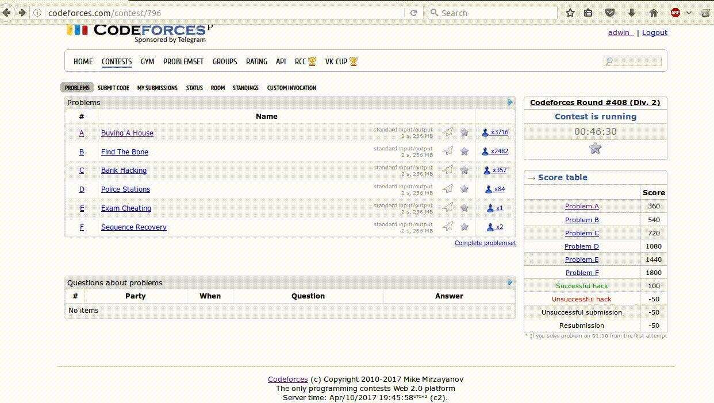

This script downloads examples (testcases - pairs of input & output for each problem) from [codeforces](http://codeforces.com) contests.


fetch-cf-examples install:
```bash
git clone https://github.com/adw1n/competitive-programming
sudo pip3 install competitive-programming/tools/fetch_codeforces_examples
```
fetch-cf-examples uninstall:
```bash
sudo pip3 uninstall fetch-codeforces-examples
```

Requirements:
* python >= 3.4


fetch-cf-examples usage:
```bash
fetch-cf-examples --help
fetch-cf-examples --demo --link http://codeforces.com/contest/777 #will save to /tmp/codeforces
```
Real usage:
```bash
#examples saved to ~/algo_competitions/cf404/A/... ~/algo_competitions/cf404/B/...
#after ~2 seconds all examples are downloaded - much faster than copy pasting by hand
fetch-cf-examples -l http://codeforces.com/contest/777 -n cf404
```
or you can provide link to a problem (instead of link to a contest) - script will detect the contest automatically
```bash
fetch-cf-examples -l http://codeforces.com/contest/670/problem/A -n cf404
```

Program output:
```bash
Downloading examples from: http://codeforces.com/contest/777 to /home/username/algo_competitions/cf404
```
Before:
```bash
tree ~/algo_competitions/cf350
├── A
│   ├── A.cbp
│   └── main.cpp
├── B
│   ├── B.cbp
│   └── main.cpp
├── C
│   ├── C.cbp
│   └── main.cpp
...
```
After:
```bash
tree ~/algo_competitions/cf350
├── A
│   ├── A.cbp
│   ├── expected1.txt
│   ├── expected2.txt
│   ├── in1.txt
│   ├── in2.txt
│   └── main.cpp
...
├── D
│   ├── D.cbp
│   ├── expected1.txt
│   ├── expected2.txt
│   ├── expected3.txt
│   ├── expected4.txt
│   ├── in1.txt
│   ├── in2.txt
│   ├── in3.txt
│   ├── in4.txt
│   └── main.cpp
...

cat ~/algo_competitions/cf350/D/in1.txt
3 1
2 1 4
11 3 16
cat ~/algo_competitions/cf350/D/expected1.txt
4
```

Providing explicitly directory to save to:
```bash
#examples saved to /tmp/yolo
fetch-cf-examples --link http://codeforces.com/contest/777 --contest-dir /tmp/yolo
```

When regular* codeforces round is taking place, script can auto detect the contest that you are taking part in - you don't need to specify the contest link.
```bash
#please set the USERNAME variable in fetch_cf_examples.py script for the script to be able to auto detect the division that you belong to
fetch-cf-examples -n cf404
```
*regular - like any Div 1 / Div 2 round, it won't handle (auto detect) some special contests like April Fools etc. Your best bet for those is to provide link to the contest explicitly.
